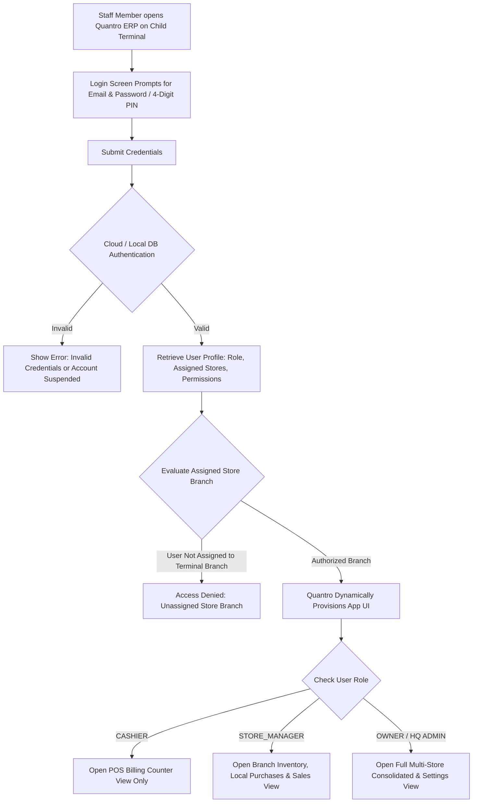

# Multi-Store Cloud Sync, Parent-Child Architecture, HR-Payroll & RBAC Specification
**Product:** Quantro ERP by Maze Lab  
**Document Version:** 1.5.0  
**Target Release:** v2.11.0  
**Status:** Approved Architecture (HR-Payroll, Authentication & Dual-Layer Governance)  

---

## 1. Executive Summary & Vision

The **Multi-Store Cloud Sync, HR-Payroll & Parent-Child System** transforms Quantro ERP from a single-location desktop POS into an enterprise-grade, parent-child retail network & workforce management engine.

Businesses operating multiple physical outlets require a **Credential-Driven Authentication & HR-Payroll Framework**:
1. **Email & Password Staff Authentication:** Staff members (Branch Managers, Cashiers, Inventory Clerks) log in with their corporate email and secure password/PIN on any connected Child ERP instance.
2. **Dynamic UI Role Provisioning:** Upon authentication, Quantro evaluates the user's **Assigned Role** and **Assigned Store Branch**, automatically unlocking or restricting app modules (e.g. Store Manager logs in -> Store Manager View opens; Cashier logs in -> POS Billing View opens).
3. **Integrated HR & Payroll Module:** Centralized workforce management inside Quantro ERP for employee profiles, credential provisioning, role assignment, POS clock-in/out attendance, base salary setup, and monthly payroll processing.
4. **Parent HQ HR Governance:** Employee profile creation, login credential assignment, and company-wide payroll processing are governed exclusively by Parent HQ. Child branch managers can only view local branch shift schedules and clock-in logs.

---

## 2. Staff Authentication & Login Flow



---

## 3. Dedicated HR & Payroll Module Architecture

Quantro ERP introduces a fully integrated **HR & Payroll Module** accessible via the main sidebar (`/hr-payroll`):

```
+-----------------------------------------------------------------------------------+
| 👥 HR & PAYROLL MODULE                                                            |
+-----------------------------------------------------------------------------------+
| [ 👤 Employees & Credentials ]  [ ⏱️ Attendance & Shifts ]  [ 💰 Payroll & Slips ] |
+-----------------------------------------------------------------------------------+
```

### 3.1 Sub-Module 1: Employee Profiles & Credential Provisioning

Located under `HR & Payroll > Employees & Credentials`:

#### **Employee Profile & Account Creation Form**
- **Personal Details:** Full Name, Designation, Department, Phone, Personal Email, Emergency Contact.
- **Login Credentials:**
  - **Work Login Email:** (e.g., `rajesh.b2@quantro.app`)
  - **Password / 4-Digit Quick POS PIN:** Encrypted using bcrypt.
  - **Account Status:** `ACTIVE`, `SUSPENDED`, `TERMINATED` *(Deactivating an employee immediately blocks login across all child terminals)*.
- **Role Assignment Dropdown:**
  - `👑 OWNER / HQ ADMIN`
  - `👔 REGIONAL_MANAGER`
  - `🏢 STORE_MANAGER`
  - `🛒 CASHIER`
  - `📦 INVENTORY_CLERK`
  - `📊 ACCOUNTANT`
- **Assigned Branch(es):** Multi-select checkbox (`Branch 1 HQ`, `Branch 2 Downtown`, `Branch 3 Westside`, or `All Branches`).

---

### 3.2 Sub-Module 2: POS Attendance & Shift Management

Located under `HR & Payroll > Attendance & Shifts`:

- **POS Clock-In / Clock-Out:**
  - Cashiers and staff clock in directly at the POS login screen using their 4-digit PIN.
  - Automatically records `clock_in_time`, `clock_out_time`, `terminal_device_id`, and `store_id`.
- **Shift Reconciliation Report:**
  - Tracks total cash collected during shift vs expected cash drawer balance.
  - Automatically generates Cashier Shift Summary PDF upon clock-out.

---

### 3.3 Sub-Module 3: Payroll & Compensation Ledger

Located under `HR & Payroll > Payroll & Slips`:

- **Salary Structure Configuration:**
  - **Base Monthly Salary:** (e.g., ₹25,000 / month)
  - **Allowances:** (HRA, Conveyance, Performance Bonus)
  - **Deductions:** (PF, ESI, Advance Adjustments)
  - **Net Payable Salary:** Automatically calculated (`Base + Allowances - Deductions`).
- **Monthly Payroll Execution:**
  - HQ Admin generates monthly payroll for all outlets with 1-click execution.
  - Automatically posts expense entry to Quantro Financial Accounting Ledger (`Salary Expense`).
  - Generates downloadable PDF Salary Slips for each employee.

---

## 4. Parent HQ HR Governance vs Child Branch Permissions

| HR & Payroll Feature | 👑 Parent Owner / HR Admin | 🏢 Store Manager (Child) | 🛒 Cashier / Staff |
| :--- | :---: | :---: | :---: |
| **Create / Edit Employee Profiles** | ✅ | ❌ | ❌ |
| **Assign Login Emails & Passwords** | ✅ | ❌ | ❌ |
| **Assign Roles & Branch Access** | ✅ | ❌ | ❌ |
| **Suspend / Terminate Accounts** | ✅ | ❌ | ❌ |
| **View Local Branch Staff List** | ✅ | ✅ *(Assigned Branch Only)*| ❌ |
| **View Shift Clock-In / Out Logs** | ✅ | ✅ *(Assigned Branch Only)*| View Own Logs Only |
| **View Employee Salaries & Payroll** | ✅ | 🔒 **LOCKED** | View Own Salary Slip Only |
| **Execute Monthly Salary Payouts** | ✅ | 🔒 **LOCKED** | ❌ |

---

## 5. Universal Multi-Branch Stacked Settings Architecture

As new branches are added/paired (`Company 1 Parent`, `Branch 2 Child`, `Branch 3 Child`), **every settings tab** in Quantro ERP dynamically expands into stacked, branch-specific configuration sections under the same master tab view.

```text
+-----------------------------------------------------------------------------------+
| ⚙️ SETTINGS > BUSINESS PROFILE & CONTACT                                          |
+-----------------------------------------------------------------------------------+
|                                                                                   |
|  🏢 Business & Contact (Company 1 - Parent HQ)                                    |
|  -------------------------------------------------------------------------------  |
|  Shop / Business Name : Quantro (Main HQ)                                         |
|  GSTIN Number         : 24AAAAA0000A1Z5                                           |
|  Default Place Supply : 09-Uttar Pradesh                                          |
|  Phone Number         : +91 8866115898                                            |
|  Email Address        : Quantro.Support.63@gmail.com                              |
|  Business Logo        : [ Logo Preview / Upload ]                                 |
|                                                                                   |
|  -------------------------------------------------------------------------------  |
|                                                                                   |
|  🏬 Business & Contact (Branch 2 - Downtown Outlet)                               |
|  -------------------------------------------------------------------------------  |
|  Shop / Business Name : Quantro (Branch 2 - Downtown)                             |
|  GSTIN Number         : 24AAAAA0000A1Z5                                           |
|  Default Place Supply : 09-Uttar Pradesh                                          |
|  Phone Number         : +91 8866115898                                            |
|  Email Address        : Quantro.Support.63@gmail.com                              |
|  Business Logo        : [ Branch Logo Preview / Upload ]                          |
|                                                                                   |
+-----------------------------------------------------------------------------------+
```

---

## 6. Multi-User Job Profiles & Role Permission Matrix (RBAC)

Quantro ERP enforces an industry-standard **Role-Based Access Control (RBAC)** architecture. Every staff member is assigned a **Job Profile** and scoped to one or more **Store Branches**.

### 6.1 Detailed Permission Matrix by Feature

| Feature / UI Module | 👑 Parent Owner | 👔 Regional Manager | 🏢 Store Manager | 🛒 Cashier | 📦 Inventory Clerk | 📊 Accountant |
| :--- | :---: | :---: | :---: | :---: | :---: | :---: |
| **POS Sales Cart & Checkout** | ✅ | ✅ | ✅ | ✅ | ❌ | ❌ |
| **Apply Discount / Custom Price** | ✅ | ✅ | ⚠️ *(Limited %)* | ❌ | ❌ | ❌ |
| **View Retail Selling Prices** | ✅ | ✅ | ✅ | ✅ | ✅ | ✅ |
| **View Wholesale Purchase Cost** | ✅ | ❌ | ❌ | ❌ | ❌ | ✅ |
| **View Store Net Profit & Margins** | ✅ | ❌ | ❌ | ❌ | ❌ | ✅ |
| **View Executive Payroll & Salaries** | ✅ | ❌ | ❌ | ❌ | ❌ | ❌ |
| **Inventory Stock Add / Edit** | ✅ | ✅ | ✅ | ❌ | ✅ | ❌ |
| **Stock Transfer Request / Receive** | ✅ | ✅ | ✅ | ❌ | ✅ | ❌ |
| **Create Purchase Bills / Suppliers** | ✅ | ✅ | ✅ | ❌ | ❌ | ✅ |
| **Customer Credit & Dues View** | ✅ | ✅ | ✅ | ✅ | ❌ | ✅ |
| **Delete Invoices / Cancel Orders** | ✅ | ❌ | ⚠️ *(Passcode)* | ❌ | ❌ | ❌ |
| **Store Switcher (View All Stores)** | ✅ | ⚠️ *(Assigned Only)*| ❌ | ❌ | ❌ | ⚠️ *(Assigned Only)*|
| **Parent HQ Global Settings Edit** | ✅ | ❌ | ❌ | ❌ | ❌ | ❌ |

---

## 7. Database Schema Extensions

### 7.1 HR & Employee Credentials Table: `employees`
```sql
CREATE TABLE IF NOT EXISTS employees (
    id INTEGER PRIMARY KEY AUTOINCREMENT,
    employee_code TEXT UNIQUE NOT NULL, -- e.g. EMP-001
    full_name TEXT NOT NULL,
    email TEXT UNIQUE NOT NULL,
    phone TEXT,
    password_hash TEXT NOT NULL,
    pos_pin_hash TEXT,
    role TEXT NOT NULL DEFAULT 'CASHIER', -- 'OWNER', 'REGIONAL_MGR', 'STORE_MGR', 'CASHIER', 'INVENTORY_CLERK', 'ACCOUNTANT'
    assigned_store_ids TEXT DEFAULT '[]', -- JSON Array e.g. [2] or [1, 2] or ['*']
    department TEXT,
    designation TEXT,
    base_salary REAL DEFAULT 0,
    allowances REAL DEFAULT 0,
    deductions REAL DEFAULT 0,
    status TEXT DEFAULT 'ACTIVE', -- 'ACTIVE', 'SUSPENDED', 'TERMINATED'
    created_at TIMESTAMP DEFAULT CURRENT_TIMESTAMP,
    updated_at TIMESTAMP DEFAULT CURRENT_TIMESTAMP
);

-- Attendance & Shift Log Table
CREATE TABLE IF NOT EXISTS employee_attendance (
    id INTEGER PRIMARY KEY AUTOINCREMENT,
    employee_id INTEGER NOT NULL REFERENCES employees(id),
    store_id INTEGER NOT NULL REFERENCES stores(id),
    clock_in_time TIMESTAMP NOT NULL,
    clock_out_time TIMESTAMP,
    starting_cash_drawer REAL DEFAULT 0,
    ending_cash_drawer REAL DEFAULT 0,
    notes TEXT
);

-- Payroll Disbursements Table
CREATE TABLE IF NOT EXISTS payroll_disbursements (
    id INTEGER PRIMARY KEY AUTOINCREMENT,
    payroll_month TEXT NOT NULL, -- e.g. '2026-07'
    employee_id INTEGER NOT NULL REFERENCES employees(id),
    store_id INTEGER NOT NULL REFERENCES stores(id),
    gross_salary REAL NOT NULL,
    net_salary REAL NOT NULL,
    status TEXT DEFAULT 'PAID', -- 'PENDING', 'PAID'
    disbursed_at TIMESTAMP DEFAULT CURRENT_TIMESTAMP
);
```

---

## 8. Summary of Benefits

1. **Seamless Email/PIN Authentication:** Staff members log in with their work email and password; Quantro automatically opens the exact feature scope permitted for their role.
2. **Centralized HR & Payroll Management:** Dedicated workforce hub for managing employee credentials, attendance, shift clock-ins, base salaries, and monthly pay slips.
3. **Strict Salary Privacy:** Base salaries, allowances, and payroll executions are strictly locked from branch managers and cashiers.
4. **Instant Security Revocation:** Deactivating an employee at Parent HQ immediately blocks their login across all child terminals.

---
*Document updated under `plans_mazeERP/multi_store_cloud_sync_design.md` for Quantro ERP development team.*
